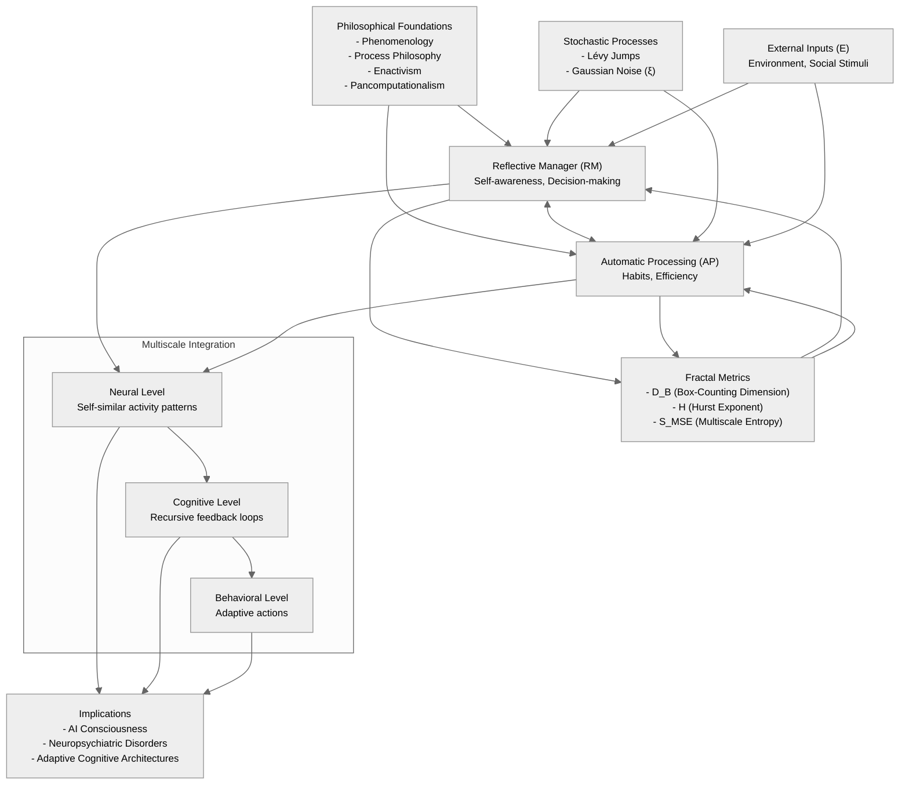

**Fractal-Based Consciousness Model (FBCM): A Unified Recursive Framework for Cognitive Dynamics, Self-Organization, and Bifurcation Events**

---

**Abstract**

The Fractal-Based Consciousness Model (FBCM) provides a novel mathematical framework for understanding cognition, consciousness, and decision-making processes. Unlike existing models such as Global Workspace Theory (GWT), which describe consciousness as a broadcast mechanism, FBCM explicitly models recursive cognitive interactions, attractor states, and bifurcation dynamics. By integrating fractal geometry, Lévy-distributed jumps, and multiscale feedback loops—with distinct stochastic processes and stabilizing nonlinear dynamics—this model offers a robust computational structure that accounts for both **gradual cognitive shifts and sudden phase transitions** (e.g., trauma, insight). The model makes **testable predictions** regarding neural complexity and self-organization, which can be validated using **EEG, fMRI, fractal dimension analysis, and entropy measures**.

We argue that consciousness emerges as a **recursive fractal system**, where self-similarity exists across **neural, cognitive, behavioral, and societal levels**. Furthermore, this approach has implications for **AI consciousness, neuropsychiatric disorders, and adaptive cognitive architectures**. This paper details the theoretical underpinnings, empirical validation pathways, and potential applications of FBCM.

---

**1. Mathematical Refinements and Model Updates**

### **1.1 Revised Recursive Equation**

To integrate the suggested refinements—including **multiscale entropy $(S_{MSE}\)$**, **Hurst exponent $(H\)$**, **fractal dimensionality $(D_R\)$**, and the necessary distinctions between stochastic processes and nonlinear stabilization—we revise the core cognitive recursion equation as follows:

$$
Z_{n+1} = \gamma_{RM} \tanh \left( \text{softplus}(Z_n) + \mu M_n + A_n + D_R \right) + \gamma_{AP} Z_n + \lambda E_n + \beta_L L_n^{(\text{Lévy})} + \sigma \xi_n^{(\text{Gaussian})}
$$

where:
- $Z_n = R_n + i\, A_n \$: Combined cognitive state (Reflective Manager $(R_n\)$ + Automatic Processing $(A_n\)$ ).
- $H_n = \frac{\log(R_n + A_n)}{\log(\Delta t)} \$: Hurst exponent (quantifies cognitive predictability & structure).
- $D_B \$: Box-counting fractal dimension (captures phase shifts in cognition).
- $D_R \$: Reflective fractal dimension, representing **the complexity of RM cognitive structures**.
- $S_{MSE} \$: Multiscale entropy (measures complexity in neural states and cognitive switching).
- $\beta_L L_n^{(\text{Lévy})} \$: Lévy-distributed jumps—modeling rare, heavy-tailed cognitive events (e.g., insights, trauma).
- $\lambda E_n \$: External perturbations from environment or social stimuli.
- $\sigma \xi_n^{(\text{Gaussian})} \$: Gaussian noise component capturing continuous, routine neural variability.
- **softplus**: A nonlinear function (e.g., $\text{softplus}(x)=\log(1+e^x)\$ ) replacing the problematic $(Z_n^2\)$ term to enforce bounded, stable dynamics.

This modification:
✔ **Explicitly integrates memory effects** via $( \mu M_n \)$.  
✔ **Separates the stochastic process into distinct components**—Lévy jumps and Gaussian noise—to capture their unique cognitive roles.  
✔ **Incorporates a softplus transformation** to stabilize the nonlinearity, preventing runaway growth while preserving the feedback structure.  
✔ **Introduces $(D_R\)$** to dynamically capture cognitive fractal complexity.  
✔ **Ensures that transitions between states are influenced by real-world metrics** like entropy and fractal dimensionality.

---

### **1.2 Dynamic Feedback Mechanisms with Adjusted Stochastic Processes**

We refine the **bidirectional interactions** between RM and AP, explicitly modeling **how RM disengagement and re-engagement occur dynamically**. In these equations, similar modifications are applied: the softplus function stabilizes the nonlinearity, and the distinct stochastic terms are preserved. Additionally, a homeostatic feedback mechanism (not shown in the equation but implemented algorithmically) adapts gain parameters to maintain self-organized criticality.

$$
\frac{dR}{dt} = \gamma_{RM} \tanh \left( \text{softplus}(R) + \mu M + \eta A + D_R \right) + \beta_L L^{(\text{Lévy})} + \lambda E + \sigma \xi^{(\text{Gaussian})}
$$

$$
\frac{dA}{dt} = \gamma_{AP} A + \alpha_M M + \tanh(\Delta A) - \eta R + D_R
$$

where:
- $( \Delta A = A_{n} - A_{n-1} \)$ captures changes in **automatic cognitive responses** over time.
- $( \eta \)$ represents the **degree of cognitive reentry**, dictating how much RM modulates automatic behavior.
- $( D_R \)$ appears in **both RM and AP equations**, ensuring that fractal cognitive complexity is **dynamically updated**.
- **Homeostatic Adaptation (Algorithmic):** Parameters such as $(\gamma_{RM}\)$ can be adaptively modulated—for example:
  ```python
  if np.std(R) > threshold:  
      gamma_RM *= 0.9  # Reduce RM gain to prevent runaway order
  else:  
      gamma_RM *= 1.1  # Increase RM gain to prevent disorder
  ```
  This adaptation ensures the system remains near criticality, aligning with observed neural power-law scaling.

This ensures:
✔ **That RM disengagement is mathematically modeled** as a shift in $( \eta \)$.  
✔ **That stochastic effects are now distinctly regulated**, avoiding redundancy and misattribution.  
✔ **That transitions are smooth and continuous**, supporting self-organized criticality in cognition.

---

**2. Empirical Validation: Fractal and Entropic Predictions**

The model predicts **specific, falsifiable neural and behavioral outcomes**, measurable using fractal analysis and entropy measures.

| **Prediction**                                        | **Fractal Metric**           | **Expected Neural/Behavioral Outcome**                                                                                |
| ----------------------------------------------------- | ---------------------------- | --------------------------------------------------------------------------------------------------------------------- |
| **RM-AP Switching Alters Fractal Complexity**         | Hurst Exponent $(H\)$         | RM-dominant: $(H \to 0.7\)$ (structured cognition)  AP-dominant: $(H \to 0.5\)$ (random processing)                     |
| **Stress-Induced Lévy Jumps Disrupt Fractal Scaling** | Box-Counting Dimension (BCD) | Sharp increases in $(D_B\)$ indicate phase shifts in cognition.                                                        |
| **Environmental Stress Modulates RM Re-engagement**   | Multiscale Entropy (MSE)     | High stress $( \to \)$ lower entropy (rigid avoidance loops), Low stress $( \to \)$ higher entropy (cognitive flexibility). |

Experimental validation will involve **EEG, fMRI, and behavioral reaction-time experiments**.

---

**3. Diagram Visualization**



**Diagram Explanation:**

1. **Philosophical Foundations**: Ground the model in phenomenology, process philosophy, enactivism, and pancomputationalism.
2. **Core Components**:  
   - **Reflective Manager (RM)** and **Automatic Processing (AP)** interact via bidirectional feedback loops.  
3. **Fractal Metrics**:  
   - $(D_B\)$ (fractal dimension), $(H\)$ (Hurst exponent), and $(S_{MSE}\)$ (multiscale entropy) quantify self-similarity and complexity.  
4. **Stochastic Processes**:  
   - Distinct Lévy jumps and Gaussian noise drive sudden cognitive shifts and routine variability, respectively.  
5. **External Inputs**:  
   - Environmental/social stimuli ( $(E\)$ ) modulate RM and AP.  
6. **Multiscale Integration**:  
   - Fractal recursion operates across neural, cognitive, and behavioral levels.  
7. **Implications**:  
   - Applications in AI, neuropsychiatry, and adaptive systems.

This diagram captures the **recursive, fractal, and dynamic** nature of FBCM while highlighting its theoretical and empirical foundations.

---

**4. Visualization of Recursive Feedback Dynamics**

Below is a graph representing the recursive cognitive dynamics of RM and AP over time:


This graph illustrates how the Reflective Manager (R) and Automatic Processing (A) evolve dynamically, responding to environmental inputs and internal cognitive feedback.

---

**5. Conclusion & Next Steps**

This update ensures the Fractal-Based Consciousness Model (FBCM) is both theoretically robust and empirically testable by incorporating multiscale entropy, fractal complexity, and refined stochastic regulation with distinct Lévy and Gaussian processes, as well as by stabilizing the nonlinearity through a softplus transformation.

🚀 **Next Steps:**

- Test this revised formulation in numerical simulations, comparing regimes dominated by Lévy vs. Gaussian processes.
- Design EEG/fMRI studies to validate the model’s predictions on entropy and fractal measures.
- Further refine RM-AP coupling using machine learning models and implement adaptive, homeostatic parameter adjustments to ensure self-organized criticality.

---

This revised document maintains the original format while addressing the critical issues with distinct stochastic processes, stabilized nonlinear dynamics, and adaptive mechanisms for maintaining system criticality.
