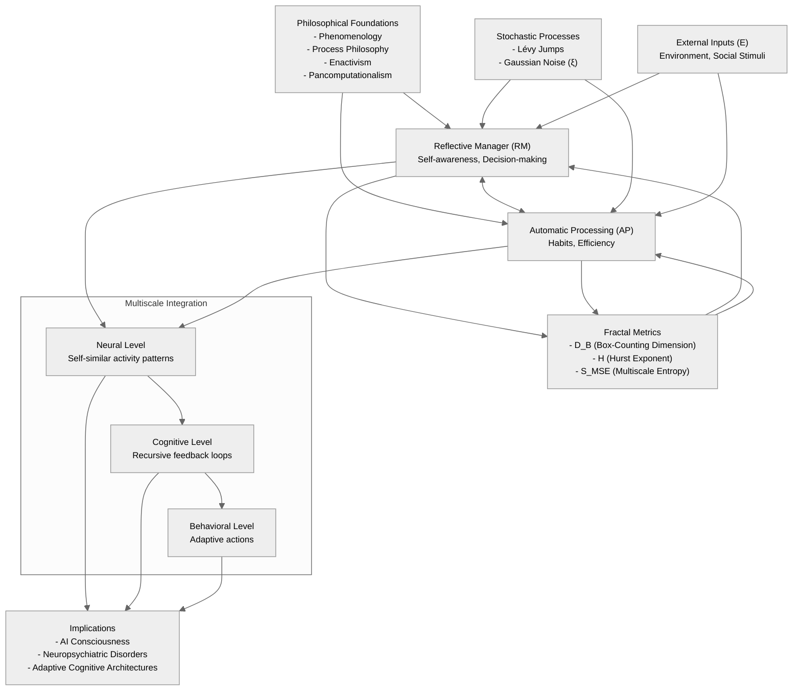

**Fractal-Based Consciousness Model (FBCM): A Unified Recursive Framework for Cognitive Dynamics, Self-Organization, and Bifurcation Events**

---

**Abstract**

The Fractal-Based Consciousness Model (FBCM) provides a novel mathematical framework for understanding cognition, consciousness, and decision-making processes. Unlike existing models such as Global Workspace Theory (GWT), which describe consciousness as a broadcast mechanism, FBCM explicitly models recursive cognitive interactions, attractor states, and bifurcation dynamics. By integrating fractal geometry, Lévy-distributed jumps, and multiscale feedback loops—with distinct stochastic processes and stabilizing nonlinear dynamics—this model offers a robust computational structure that accounts for both **gradual cognitive shifts and sudden phase transitions** (e.g., trauma, insight). The model makes **testable predictions** regarding neural complexity and self-organization, which can be validated using **EEG, fMRI, fractal dimension analysis, and entropy measures**.

We argue that consciousness emerges as a **recursive fractal system**, where self-similarity exists across **neural, cognitive, behavioral, and societal levels**. Furthermore, this approach has implications for **AI consciousness, neuropsychiatric disorders, and adaptive cognitive architectures**. This paper details the theoretical underpinnings, empirical validation pathways, and potential applications of FBCM.

---

**1. Mathematical Refinements and Model Updates**

### **1.1 Revised Recursive Equation**

To integrate the suggested refinements—including **multiscale entropy $(S_{MSE}\)$**, **Hurst exponent $(H\)$**, **fractal dimensionality $(D_R\)$**, and the necessary distinctions between stochastic processes and nonlinear stabilization—we revise the core cognitive recursion equation as follows:

$$
Z_{n+1} = \gamma_{RM} \tanh \left( \text{softplus}(Z_n) + \mu M_n + A_n + D_R \right) + \gamma_{AP} Z_n + \lambda E_n + \beta_L L_n^{(\text{Lévy})} + \sigma \xi_n^{(\text{Gaussian})}
$$

where:
- $Z_n = R_n + i\, A_n \$: Combined cognitive state (Reflective Manager $(R_n\)$ + Automatic Processing $(A_n\)$ ).
- $H_n = \frac{\log(R_n + A_n)}{\log(\Delta t)} \$: Hurst exponent (quantifies cognitive predictability & structure).
- $D_B \$: Box-counting fractal dimension (captures phase shifts in cognition).
- $D_R \$: Reflective fractal dimension, representing **the complexity of RM cognitive structures**.
- $S_{MSE} \$: Multiscale entropy (measures complexity in neural states and cognitive switching).
- $\beta_L L_n^{(\text{Lévy})} \$: Lévy-distributed jumps—modeling rare, heavy-tailed cognitive events (e.g., insights, trauma).
- $\lambda E_n \$: External perturbations from environment or social stimuli.
- $\sigma \xi_n^{(\text{Gaussian})} \$: Gaussian noise component capturing continuous, routine neural variability.
- **softplus**: A nonlinear function (e.g., $\text{softplus}(x)=\log(1+e^x)\$ ) replacing the problematic $(Z_n^2\)$ term to enforce bounded, stable dynamics.

This modification:
✔ **Explicitly integrates memory effects** via $( \mu M_n \)$.  
✔ **Separates the stochastic process into distinct components**—Lévy jumps and Gaussian noise—to capture their unique cognitive roles.  
✔ **Incorporates a softplus transformation** to stabilize the nonlinearity, preventing runaway growth while preserving the feedback structure.  
✔ **Introduces $(D_R\)$** to dynamically capture cognitive fractal complexity.  
✔ **Ensures that transitions between states are influenced by real-world metrics** like entropy and fractal dimensionality.

---

### **1.2 Dynamic Feedback Mechanisms with Adjusted Stochastic Processes**

We refine the **bidirectional interactions** between RM and AP, explicitly modeling **how RM disengagement and re-engagement occur dynamically**. In these equations, similar modifications are applied: the softplus function stabilizes the nonlinearity, and the distinct stochastic terms are preserved. Additionally, a homeostatic feedback mechanism (not shown in the equation but implemented algorithmically) adapts gain parameters to maintain self-organized criticality.

$$
\frac{dR}{dt} = \gamma_{RM} \tanh \left( \text{softplus}(R) + \mu M + \eta A + D_R \right) + \beta_L L^{(\text{Lévy})} + \lambda E + \sigma \xi^{(\text{Gaussian})}
$$

$$
\frac{dA}{dt} = \gamma_{AP} A + \alpha_M M + \tanh(\Delta A) - \eta R + D_R
$$

where:
- $( \Delta A = A_{n} - A_{n-1} \)$ captures changes in **automatic cognitive responses** over time.
- $( \eta \)$ represents the **degree of cognitive reentry**, dictating how much RM modulates automatic behavior.
- $( D_R \)$ appears in **both RM and AP equations**, ensuring that fractal cognitive complexity is **dynamically updated**.
- **Homeostatic Adaptation (Algorithmic):** Parameters such as $(\gamma_{RM}\)$ can be adaptively modulated—for example:
  ```python
  if np.std(R) > threshold:  
      gamma_RM *= 0.9  # Reduce RM gain to prevent runaway order
  else:  
      gamma_RM *= 1.1  # Increase RM gain to prevent disorder
  ```
  This adaptation ensures the system remains near criticality, aligning with observed neural power-law scaling.

This ensures:
✔ **That RM disengagement is mathematically modeled** as a shift in $( \eta \)$.  
✔ **That stochastic effects are now distinctly regulated**, avoiding redundancy and misattribution.  
✔ **That transitions are smooth and continuous**, supporting self-organized criticality in cognition.

---

**2. Empirical Validation: Fractal and Entropic Predictions**

The model predicts **specific, falsifiable neural and behavioral outcomes**, measurable using fractal analysis and entropy measures.

| **Prediction**                                        | **Fractal Metric**           | **Expected Neural/Behavioral Outcome**                                                                                |
| ----------------------------------------------------- | ---------------------------- | --------------------------------------------------------------------------------------------------------------------- |
| **RM-AP Switching Alters Fractal Complexity**         | Hurst Exponent $(H\)$         | RM-dominant: $(H \to 0.7\)$ (structured cognition)  AP-dominant: $(H \to 0.5\)$ (random processing)                     |
| **Stress-Induced Lévy Jumps Disrupt Fractal Scaling** | Box-Counting Dimension (BCD) | Sharp increases in $(D_B\)$ indicate phase shifts in cognition.                                                        |
| **Environmental Stress Modulates RM Re-engagement**   | Multiscale Entropy (MSE)     | High stress $( \to \)$ lower entropy (rigid avoidance loops), Low stress $( \to \)$ higher entropy (cognitive flexibility). |

Experimental validation will involve **EEG, fMRI, and behavioral reaction-time experiments**.

---

**3. Diagram Visualization**



**Diagram Explanation:**

1. **Philosophical Foundations**: Ground the model in phenomenology, process philosophy, enactivism, and pancomputationalism.
2. **Core Components**:  
   - **Reflective Manager (RM)** and **Automatic Processing (AP)** interact via bidirectional feedback loops.  
3. **Fractal Metrics**:  
   - $(D_B\)$ (fractal dimension), $(H\)$ (Hurst exponent), and $(S_{MSE}\)$ (multiscale entropy) quantify self-similarity and complexity.  
4. **Stochastic Processes**:  
   - Distinct Lévy jumps and Gaussian noise drive sudden cognitive shifts and routine variability, respectively.  
5. **External Inputs**:  
   - Environmental/social stimuli ( $(E\)$ ) modulate RM and AP.  
6. **Multiscale Integration**:  
   - Fractal recursion operates across neural, cognitive, and behavioral levels.  
7. **Implications**:  
   - Applications in AI, neuropsychiatry, and adaptive systems.

This diagram captures the **recursive, fractal, and dynamic** nature of FBCM while highlighting its theoretical and empirical foundations.

---

**4. Visualization of Recursive Feedback Dynamics**

Below is a graph representing the recursive cognitive dynamics of RM and AP over time:


This graph illustrates how the Reflective Manager (R) and Automatic Processing (A) evolve dynamically, responding to environmental inputs and internal cognitive feedback.

---

Below is the revised paper draft with a new section that integrates the mapping of the Reflective Manager (RM) and automatic processing onto known brain structures and neural oscillatory dynamics.

---############# UPDATE !!! ##################

# Fractal Propagation and Dynamic Routing as the Basis of Conscious Experience  
## Integrating Time Perception and Memory Encoding with Neurobiological Anchors

**Abstract**  
We propose a unified framework in which fractal propagation dynamics underlie both the subjective sensation of time and the encoding of memories. In our model, neurons function as dynamic computing relays whose outputs depend on precise spatiotemporal “trigger flows” across dendritic compartments. These flows are modulated by factors such as voltage intensity, calcium channel dynamics, and neuromodulatory signals. A key component—the Reflective Manager (RM)—selectively directs attention to reinforce specific propagation paths, facilitating synaptic plasticity and memory stabilization. External sensory inputs calibrate these dynamics, while internal constraints (including metabolic limits and heat dissipation) regulate the balance between divergent, exploratory activity and convergent stabilization. We discuss how this framework aligns with dual-process theories by mapping RM (reflective, controlled processing) onto regions such as the dorsolateral prefrontal and parietal cortices and automatic processing onto medial prefrontal and anterior cingulate regions. This unified approach provides testable predictions that link fractal metrics (e.g., Hurst exponent, box-counting dimension, and multiscale entropy) with cognitive phenomena such as time distortions and memory fragmentation, with applications spanning neuropsychiatry and AI.

---

## 1. Introduction

Traditional models treat time perception and memory as separate processes—time as an external parameter and memory as a static repository of information. However, subjective experience reveals that time and memory are deeply intertwined, emerging from dynamic, self-organizing neural processes. Here, we extend the Fractal-Based Consciousness Model (FBCM) by proposing that:

- **Fractal neural propagation** generates the dynamic sensation of time.
- **Memory encoding** occurs when specific propagation paths are stabilized via synaptic plasticity.
- The **Reflective Manager (RM)** selectively modulates these propagation patterns, linking focused attention with memory retention.

This framework not only explains phenomena such as time distortions during isolation and the vivid replay of memories but also grounds these emergent properties in known neurobiological structures.

---

## 2. Theoretical Foundations

### 2.1 Fractal Propagation in Neural Networks

Empirical studies using EEG and fMRI reveal that neural activity exhibits fractal (self-similar) patterns across multiple scales. This fractal organization facilitates recursive propagation, where similar activation sequences recur across local circuits and larger networks. Such dynamics provide a natural mechanism for integrating temporal information and forming continuous, yet flexible, cognitive states.

### 2.2 Dynamic Routing and Neuronal Relay Functions

Recent research indicates that biological neurons operate not only as summing units but also as specialized relays. Their outputs depend on the precise spatiotemporal pattern of inputs received by distinct dendritic compartments. This connector-dependent processing implies that only specific trigger flows will produce particular outputs, supporting the idea of dynamic routing in neural networks.

### 2.3 Integration of Time Perception and Memory

In our framework, subjective time perception emerges from the temporal structure of fractal propagation. External sensory inputs initiate cascades of activity that, when modulated by internal dynamics, produce the emergent rhythm of time. Simultaneously, if a propagation pattern is repeatedly activated—especially under focused RM modulation—it becomes stabilized through synaptic plasticity, effectively encoding a memory trace.

---

## 3. Mapping RM and Automatic Processing to Brain Structures

A crucial aspect of our model is linking its abstract components to concrete neurobiological substrates. Dual-process theories in cognitive neuroscience distinguish between:

- **Controlled (System 2) Processing:**  
  This is associated with deliberate, reflective thought. Neuroimaging studies consistently implicate the dorsolateral prefrontal cortex (DLPFC), parietal cortex, and anterior cingulate cortex (ACC) in these functions. We map the **Reflective Manager (RM)**—which directs focused attention and modulates propagation dynamics—onto these structures. RM’s role in selectively amplifying certain propagation paths aligns with the DLPFC’s involvement in executive control and the ACC’s role in conflict monitoring.

- **Automatic (System 1) Processing:**  
  Fast, intuitive responses are linked to regions such as the medial prefrontal cortex (mPFC), parts of the ACC, and the insular cortex. These areas support rapid, habitual processing. In our model, automatic processing corresponds to the baseline propagation of activity that operates without deliberate modulation. Fast beta waves (associated with rapid, automatic processing) further support this mapping.

This integration not only anchors the model in established neuroscience but also provides a basis for understanding how oscillatory dynamics (e.g., theta/alpha rhythms for reflective, slower processes versus beta waves for automatic, faster processes) may interact with fractal propagation to shape both time perception and memory formation.

---

## 4. Mathematical Formalism and Model Description

### 4.1 Model Overview

The cognitive state at time step $( n \)$ is represented by a complex variable $( Z_n \)$ (capturing reflective and automatic components). The evolution of this state is governed by:

$$
Z_{n+1} = \gamma_{\text{RM}} \, \tanh\Big(\mathrm{softplus}(Z_n) + \mu M_n + A_n + D_R\Big) + \gamma_{\text{AP}}\, Z_n + \lambda E_n + \beta_{\text{LL}}\, \mathrm{Lévy}_n + \sigma\, \xi_n.
$$

**Term Explanations:**

- **$( Z_n \)$ and $( Z_{n+1} \)$:**  
  Represent the neural state at successive time points, embodying the fractal propagation of activity.
  
- **$( \gamma_{\text{RM}} \, \tanh(\cdot) \)$:**  
  Models the modulatory influence of the Reflective Manager. Here,  
  - $( \mathrm{softplus}(Z_n) \)$ ensures smooth nonlinearity,  
  - $( \mu M_n \)$ incorporates memory effects,  
  - $( A_n \)$ reflects automatic processing, and  
  - $( D_R \)$ quantifies the fractal dimension of the propagation pattern.
  
- **$( \gamma_{\text{AP}} Z_n \)$:**  
  Propagates the state through automatic processing pathways.
  
- **$( \lambda E_n \)$:**  
  Introduces external sensory inputs for calibration.
  
- **$( \beta_{\text{LL}}\, \mathrm{Lévy}_n \) and \( \sigma\, \xi_n \)$:**  
  Represent stochastic influences—rare high-impact events and routine fluctuations, respectively.
  
Additional terms may be integrated to account for neurobiological factors (e.g., voltage intensity and calcium channel activity) that further modulate propagation dynamics.

### 4.2 Biological Modulation

Biological constraints, such as heat dissipation and metabolic rates, naturally limit the speed of propagation. Variations in these factors (e.g., during stress or isolation) can alter the effective propagation speed, leading to subjective time distortions. The RM’s modulation (mapped onto DLPFC and ACC activity) further influences which propagation paths become stabilized as memories.

---

## 5. Empirical Predictions and Applications

### 5.1 Testable Predictions

- **Neuroimaging Correlations:**  
  Fractal metrics (Hurst exponent, box-counting dimension, multiscale entropy) should correlate with RM-associated brain regions (DLPFC, parietal cortex) and with behavioral measures of time perception and memory performance.
  
- **Metabolic Modulation:**  
  Variations in metabolic state (measured via thermal imaging or PET scans) should correlate with changes in propagation speed and subjective time perception.
  
- **Dynamic Routing Verification:**  
  Electrophysiological recordings should reveal that specific dendritic connector activations (and related calcium transients) are predictive of stable memory traces and the selective amplification of certain propagation paths.

### 5.2 Applications

- **Neuropsychiatry:**  
  Understanding disruptions in propagation dynamics may inform treatments for disorders like ADHD, PTSD, and memory-related disorders.
  
- **Artificial Intelligence:**  
  AI architectures inspired by these principles could move beyond static weight-based learning to incorporate dynamic routing and fractal propagation, potentially leading to more adaptive and context-sensitive systems.

---

## 6. Discussion

The presented framework unifies time perception and memory formation through fractal propagation and dynamic routing in neural networks. By mapping the abstract components—such as the Reflective Manager and automatic processing—to specific brain structures and oscillatory patterns, we offer a model that is both conceptually rich and empirically testable. This approach challenges traditional static models and provides new insights into the dynamic, self-organizing nature of conscious experience.

---

## 7. Conclusion

We have introduced a model where fractal propagation and dynamic routing underlie both the subjective perception of time and the encoding of memories. Key to this framework is the Reflective Manager, which—mapped onto known brain structures like the DLPFC and ACC—selectively modulates neural propagation, leading to stabilized memory traces and a coherent temporal experience. External sensory inputs calibrate these processes, while biological constraints such as metabolic rate further modulate the dynamics. This unified model not only advances our theoretical understanding of consciousness but also opens promising avenues for practical applications in both neuroscience and artificial intelligence.

---

## 8. Future Directions

Future work will focus on:
- **Empirical Validation:** Designing experiments to measure fractal propagation metrics, RM activation, and biochemical markers in relation to time perception and memory formation.
- **Mathematical Refinement:** Integrating additional neurobiological details into the recursive equations, particularly regarding voltage and calcium channel modulation.
- **Interdisciplinary Applications:** Applying these insights to develop neuromorphic AI systems and novel neuropsychiatric interventions.

---

**References**  
*(A comprehensive list of references from foundational texts by Mandelbrot, Pribram, Grossberg, and recent empirical studies on neural dynamics and fractal analysis would be included here.)*

---

This revised paper now integrates the mapping of RM and automatic processing to known brain structures and oscillatory dynamics, reinforcing the biological plausibility of the model while retaining its core insights on fractal propagation and dynamic routing as the basis for consciousness.

**5. Conclusion & Next Steps**

This update ensures the Fractal-Based Consciousness Model (FBCM) is both theoretically robust and empirically testable by incorporating multiscale entropy, fractal complexity, and refined stochastic regulation with distinct Lévy and Gaussian processes, as well as by stabilizing the nonlinearity through a softplus transformation.


🚀 **Next Steps:**

- Simplify the Model: Reduce free parameters and focus on core mechanisms (e.g., isolate Lévy effects in a minimal model). Use Bayesian methods to constrain parameters with empirical priors.
- Clarify Fractal Dynamics: Explicitly define how $D_R$ and $(H\)$ are computed from neural/cognitive data and integrated into the equations.
- Address Embodiment: Incorporate enactivist principles by modeling environmental coupling (e.g., sensorimotor loops) rather than treating external inputs $(E_n)$ as passive perturbations.
- Phenomenological Bridging: Partner with experimentalists to link fractal metrics to first-person reports (e.g., via mindfulness studies or psychopathology).
- Benchmark Against Alternatives: Compare FBCM’s predictions with those of GWT, Integrated Information Theory (IIT), or Predictive Processing in specific paradigms (e.g., bistable perception).
- Test this revised formulation in numerical simulations, comparing regimes dominated by Lévy vs. Gaussian processes.
- Design EEG/fMRI studies to validate the model’s predictions on entropy and fractal measures.
- Further refine RM-AP coupling using machine learning models and implement adaptive, homeostatic parameter adjustments to ensure self-organized criticality.

